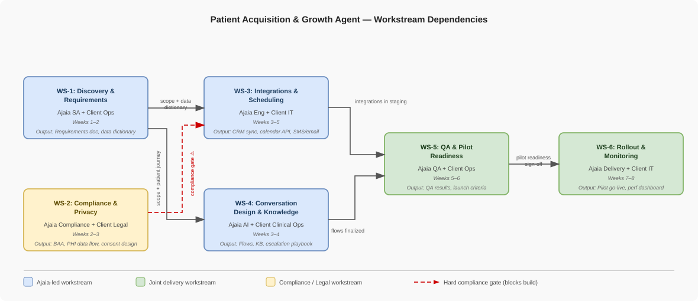

# Delivery Operating Model
## Patient Acquisition & Growth Agent — Hospital Client
**Prepared by:** Manogna Vanam | **Date:** April 18, 2026 | **Engagement Lead:** Ajaia

---

## Assumptions

- Client is a mid-size outpatient healthcare provider network (1–3 locations, 5–15 providers)
- Client has an existing patient intake and lead management workflow supported by a CRM and/or EHR system
- Scheduling is managed through an existing system (EHR-integrated or external scheduling platform) accessible via APIs or middleware
- Inbound leads originate from multiple channels including web forms, phone intake, and referral portals
- Dormant leads are defined as patients who have expressed intent but have not completed scheduling within 30 days
- The AI agent will engage patients via SMS, email, and web-based chat interfaces
- Patient consent for outreach (SMS/email) is already captured and managed by the client in compliance with regulatory requirements
- HIPAA compliance is mandatory; all PHI handling will follow BAA agreements and approved data handling practices
- AI system will not make clinical decisions; it will operate strictly within administrative workflows (scheduling, reminders, follow-ups)
- AI responses will be constrained with guardrails to prevent hallucinations and ensure safe, compliant communication
- Client IT team owns system-of-record integrations (EHR/CRM), while Ajaia provides the AI orchestration and automation layer
- Data required for operation (lead status, contact info, scheduling availability) is accessible via APIs, exports, or integration layer
- Latency requirements are near real-time for patient interactions (chat/SMS); batch processing is acceptable for lead reactivation workflows

---

## 1. Workstream Structure

### Dependency Overview

> **Reading the diagram:** Blue = Ajaia-led. Green = joint delivery. Yellow = compliance/legal. Red dashed arrow = hard gate — WS-3 cannot start until the BAA is executed and PHI data flow is approved.

### WS-1: Discovery & Requirements Alignment
**Objective:** Understand the client's current patient acquisition workflow, define the agent's scope, and align on success criteria before any build begins.

**Owner:** AI Solutions Architect (Ajaia) + Client Operations Lead

**Dependencies:**
- Client stakeholder availability (operations, IT, compliance, clinical scheduling)
- Access to current CRM/EHR workflow documentation
- Defined list of provider types and appointment categories in scope

**Primary Outputs:**
- Current-state workflow map (patient journey from inquiry to scheduled appointment)
- Agreed agent scope: channels (SMS/email/chat), use cases (inbound vs. dormant), escalation rules
- Success metrics baseline (current conversion rate, average response time, open slot fill rate)
- Signed-off requirements document
- Preliminary data dictionary (lead fields, appointment types, provider availability format)

---

### WS-2: Compliance & Privacy Review
**Objective:** Ensure the solution is HIPAA-compliant before any PHI flows through the system.

**Owner:** Ajaia Compliance Lead + Client Legal/Privacy Officer

**Dependencies:**
- Client's existing BAA and data governance policies
- Identification of all PHI fields the agent will touch (name, DOB, contact info, reason for visit)
- Confirmation of data residency requirements
- Consent and opt-out requirements for outreach (SMS/email)

**Primary Outputs:**
- Executed Business Associate Agreement (BAA)
- PHI data flow diagram (what is stored, where, for how long)
- Consent/opt-out mechanism design
- Approved data retention and deletion policy
- Compliance sign-off checklist

---

### WS-3: Integrations & Scheduling Systems
**Objective:** Connect the AI agent to the client's CRM (lead data), EHR/scheduling system (provider calendars), and outreach channels (SMS/email).

**Owner:** Ajaia Engineering Lead + Client IT

**Dependencies:**
- API documentation for CRM and EHR scheduling system
- Client IT sandbox/test environment access
- Authentication credentials and permission grants (OAuth, API keys)
- Defined appointment booking rules (provider preferences, slot durations, buffer times)
- WS-2 compliance sign-off on data fields in transit

**Primary Outputs:**
- CRM ↔ Agent sync (lead ingestion, status updates written back)
- Calendar/scheduling API integration (read availability, write appointments)
- Outreach channel setup (Twilio or equivalent for SMS, email provider)
- Integration test results document
- Data mapping specification

---

### WS-4: Conversation Design & Knowledge Setup
**Objective:** Design the agent's conversation flows, train it on clinic-specific knowledge, and define escalation paths.

**Owner:** Ajaia AI/Conversation Designer + Client Clinical Ops

**Dependencies:**
- Completed WS-1 (scope and patient journey defined)
- List of FAQs, clinic hours, service descriptions, insurance accepted
- Escalation routing rules (when to hand off to a human, which staff member)
- Tone/brand guidelines from client

**Primary Outputs:**
- Conversation flow diagrams (inbound inquiry, dormant re-engagement, scheduling confirmation, escalation)
- Agent knowledge base (FAQs, clinic info, appointment prep instructions)
- Escalation + fallback playbook
- Prompt/instruction set for the AI agent
- Sample conversations reviewed and approved by client

---

### WS-5: QA & Pilot Readiness
**Objective:** Validate the agent end-to-end before live patient exposure.

**Owner:** Ajaia QA Lead + Client Operations Lead

**Dependencies:**
- Completed WS-3 (integrations live in staging)
- Completed WS-4 (conversation flows finalized)
- Test lead dataset (synthetic or anonymized)
- Defined pass/fail criteria for pilot launch

**Primary Outputs:**
- QA test plan and results (integration, conversation, edge cases)
- Escalation path verification (human handoff tested)
- Staging environment sign-off
- Pilot launch criteria checklist (green/red status per item)
- Known issues log with resolution status

---

### WS-6: Rollout & Performance Monitoring
**Objective:** Launch the agent with a defined pilot cohort, monitor outcomes, and iterate before full rollout.

**Owner:** Ajaia Delivery Lead + Client Operations + IT

**Dependencies:**
- WS-5 sign-off
- Staff training completed (front desk, scheduling coordinators know how escalations arrive)
- Monitoring dashboard live
- Rollback plan defined

**Primary Outputs:**
- Pilot go-live (limited cohort: 2 providers, 2 appointment types — enough surface area to surface edge cases without full exposure)
- Weekly performance dashboard (response rate, scheduling conversion, escalation rate, patient complaints)
- Post-pilot retrospective and tuning recommendations
- Full rollout plan
- Handoff documentation for client ongoing operations

---

## 2. Milestone & Timeline (Weeks 1–8)

> Timeline assumes engagement start = Week 1, Day 1. All milestones are end-of-week unless noted.

| Week | Milestone | Workstreams | Key Deliverable |
|------|-----------|-------------|-----------------|
| **W1** | Kickoff & Stakeholder Alignment | WS-1 | Kickoff deck delivered; stakeholder map confirmed; project charter signed |
| **W1–W2** | Current-State Discovery | WS-1, WS-2 | Workflow map drafted; PHI fields identified; BAA execution initiated |
| **W2** | Requirements Baseline | WS-1 | Requirements doc signed off by client ops and IT |
| **W2–W3** | Compliance Foundation | WS-2 | BAA executed; data flow diagram approved; consent mechanism designed |
| **W3** | Technical Design Checkpoint | WS-3, WS-4 | Integration architecture doc reviewed; conversation flow v1 drafted |
| **W3–W4** | Integration Build Begins | WS-3 | Sandbox credentials live; CRM and calendar API connections tested |
| **W4** | Conversation Design Review | WS-4 | Agent flows reviewed with client clinical ops; knowledge base populated |
| **W5** | Integration Milestone | WS-3 | End-to-end data flow working in staging (lead in → slot booked) |
| **W5–W6** | QA Sprint | WS-5 | Test plan executed; edge cases logged; escalation paths verified |
| **W6** | Pilot Readiness Review | WS-5, WS-6 | Launch criteria checklist reviewed; green-light decision made |
| **W7** | Pilot Go-Live | WS-6 | Agent live with limited cohort (2 providers, 2 appointment types) |
| **W7–W8** | Pilot Monitoring & Tuning | WS-6 | Daily monitoring; weekly report; agent tuning based on real conversations |
| **W8** | Pilot Retrospective | WS-6 | Retrospective doc; full rollout recommendation; handoff plan drafted |

---

## 3. Dependency & Risk View

### Critical Dependencies

| Dependency | Workstream | Risk if Delayed |
|---|---|---|
| CRM/EHR API access granted by client IT | WS-3 | Blocks entire integration build; compresses QA time |
| BAA executed before any PHI flows | WS-2 | Legal/compliance blocker — can halt the engagement entirely |
| Client stakeholder availability for discovery | WS-1 | Delays requirements sign-off; cascades into design and build |
| Scheduling rules defined (buffer times, provider prefs) | WS-3, WS-4 | Agent books incorrectly; damages clinical trust immediately |
| Staff training before pilot go-live | WS-6 | Escalations arrive with no one prepared to handle them |

---

### Risk Register

#### RISK-01: PHI Handling & HIPAA Compliance Gaps
**Why it matters:** The agent touches patient names, contact info, and reason-for-visit. Any misconfiguration can result in a reportable breach — legal, financial, and reputational damage to the hospital.

**How we monitor it:** Compliance sign-off is a hard gate before WS-3 starts. PHI data flow diagram is reviewed weekly during build.

**How we mitigate it:**
- Execute BAA before any patient data enters the system
- Architect the agent to minimize PHI storage (pass-through where possible)
- Use field-level encryption for any stored PHI
- Include consent capture in the first agent message
- Conduct a pre-pilot compliance walkthrough with client legal

---

#### RISK-02: CRM/EHR Integration Complexity
**Why it matters:** Hospital EHRs (Epic, Athena) have complex, often restricted APIs. Integration timelines frequently slip by 1–2 weeks, compressing QA.

**How we monitor it:** Track API credential delivery and first successful test call as week-3 milestone. Flag at weekly standup if blocked.

**How we mitigate it:**
- Front-load IT kickoff in Week 1 (separate from business kickoff)
- Request sandbox access on Day 1 — don't wait for requirements to close
- Prepare a fallback: CSV-based lead import if CRM API is delayed
- Build integration layer with an abstraction so the EHR can be swapped without rebuilding the agent

---

#### RISK-03: Poor Lead Data Quality
**Why it matters:** Dormant lead lists often have stale phone numbers, duplicate records, or missing consent flags. The agent will fail to reach patients or send to wrong contacts.

**How we monitor it:** Run a data quality audit in Week 2 as part of discovery. Track deliverability rate from first outreach batch.

**How we mitigate it:**
- Require client to deduplicate and validate lead list before pilot
- Build a pre-send validation step (phone format check, opt-out flag check)
- Start pilot with inbound leads only (higher quality) before activating dormant list

---

#### RISK-04: Unclear Escalation Rules / Fallback Gaps
**Why it matters:** If the agent can't answer a question and has no clear handoff path, patients are left in silence — damaging trust and potentially causing missed care.

**How we monitor it:** Escalation path is QA-tested with scripted edge cases in WS-5. Monitor escalation rate and unresolved conversation rate during pilot.

**How we mitigate it:**
- Define escalation triggers explicitly in WS-1 (question types, keywords, failure states)
- Test every escalation scenario in QA before pilot
- Ensure front-desk staff have a clear protocol for AI-escalated conversations
- Build an "I'll have someone call you shortly" fallback for any unresolved path

---

#### RISK-05: Stakeholder Misalignment (Ops vs. IT vs. Clinical)
**Why it matters:** Hospital clients typically have siloed departments. Clinical ops may approve a workflow that IT can't support, or IT may expose integrations that compliance hasn't reviewed.

**How we monitor it:** Weekly check-in with a single client DRI (decision-maker). Track open decisions log.

**How we mitigate it:**
- Identify a single client DRI with authority over ops, IT, and compliance in Week 1
- Use a shared decisions log (Notion or simple doc) visible to all stakeholders
- Escalate unresolved cross-functional decisions to DRI within 48 hours

---

#### RISK-06: Low Agent Response Quality
**Why it matters:** If the agent gives wrong answers about services, insurance, or appointment availability, it erodes patient trust and creates rework for staff.

**How we monitor it:** Human review of 100% of conversations in Week 1 of pilot. Track patient satisfaction signals (did they complete scheduling? Did they escalate?).

**How we mitigate it:**
- Scope the knowledge base conservatively — better to escalate than to hallucinate
- Run red-team testing in QA (adversarial patient questions)
- Implement a confidence threshold: below threshold → escalate, don't guess
- Weekly agent review meeting during pilot to tune based on real conversations
